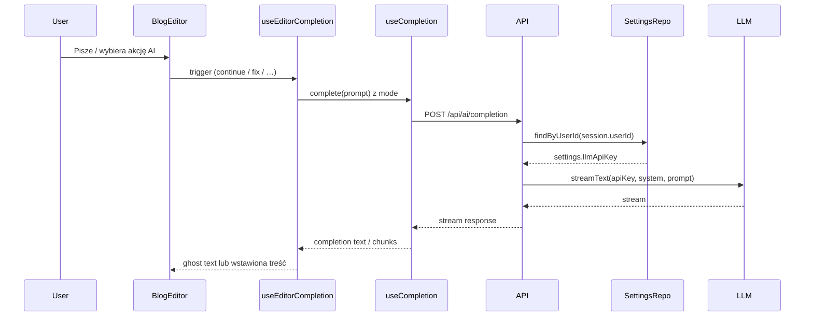

# Plan: AI completion + klucz LLM w ustawieniach + integracja z edytorem

## Kontekst

- Artykuł [How to build an AI Chat](https://ui.nuxt.com/blog/how-to-build-an-ai-chat) opisuje: Nuxt UI (UChatPrompt, UChatMessages), Vercel AI SDK (Chat, DefaultChatTransport, streamText, createUIMessageStream), MDC do renderowania odpowiedzi.
- Docelowo **nie** wdrażamy pełnego chatu — skupiamy się na **asystencie w edytorze** (ghost text + akcje typu „popraw / rozwiń / skróć”) zgodnie z sekcją [With AI completion](https://ui.nuxt.com/docs/components/editor#with-ai-completion) w dokumentacji Editora.
- Klucz LLM ma być **konfigurowalny per użytkownik** w Dashboard → Ustawienia → Integracje (obecnie placeholder w [DashboardSettingsIntegrations.vue](app/components/Dashboard/Settings/DashboardSettingsIntegrations.vue)).

---

## 1. Zależności

- `**ai**` (Vercel AI SDK) — `streamText`, protokół streamu.
- `**@ai-sdk/vue**` — `useCompletion` do ghost text i akcji w edytorze.
- Opcjonalnie `**@ai-sdk/openai**` (lub inny provider) — adapter do modelu; jeśli wolisz jeden klucz dla wielu modeli: `**@ai-sdk/gateway**` (Vercel AI Gateway).

Rekomendacja: na start **OpenAI** (`ai` + `@ai-sdk/openai`) i klucz w ustawieniach; ewentualnie później przełączenie na Gateway (jeden klucz w env).

---

## 2. Baza i ustawienia użytkownika

- **Prisma**: W modelu [UserSettings](prisma/schema.prisma) dodać pole opcjonalne na klucz LLM, np. `llmApiKey String?` (zalecane: szyfrowanie w repozytorium przed zapisem, żeby w DB nie było plain text; na MVP można bez szyfrowania, jeśli klucz nie jest nigdy zwracany do klienta).
- **Migracja**: Nowa migracja, np. `add_llm_api_key_to_user_settings`.
- **Bezpieczeństwo**: GET `/api/settings/me` **nie** zwraca `llmApiKey`; w DTO tylko flaga typu `hasLlmKey: boolean` (opcjonalnie), żeby UI wiedziało, czy pokazać „zapisano” bez ujawniania klucza. PATCH `/api/settings/me` przyjmuje `llmApiKey?: string | null` (null = usuń klucz).
- **Shared**: W [shared/schemas/settings.ts](shared/schemas/settings.ts) dodać do `SettingsUpdateSchema` pole opcjonalne `llmApiKey` (optional string lub null). W `SettingsOutputSchema` dodać co najwyżej `hasLlmKey: optional(boolean())`, bez zwracania samego klucza.
- **Domain/Repo**: W [updateUserSettings.usecase.ts](domain/settings/updateUserSettings.usecase.ts) i [settings.repo.ts](server/repositories/settings.repo.ts) obsłużyć `llmApiKey` w upsert (zapis tylko na backendzie).

---

## 3. API completion (backend)

- **Endpoint**: `POST /api/ai/completion` (lub `POST /api/completion`).
- **Autoryzacja**: Wymagana sesja (np. `requireUserSession`); userId używany do wczytania ustawień i pobrania `llmApiKey`.
- **Body** (Valibot): `prompt: string`, `mode: 'continue' | 'fix' | 'extend' | 'reduce' | 'simplify' | 'summarize' | 'translate'`, opcjonalnie `language?: string` dla translate.
- **Logika**:
  - Pobranie `UserSettings` użytkownika (np. [settingsRepository.findByUserId](server/repositories/settings.repo.ts)).
  - Źródło klucza: `settings.llmApiKey ?? process.env.NUXT_AI_API_KEY` (fallback z env dla dev/admin).
  - Brak klucza → 400/403 z czytelnym komunikatem (np. „Skonfiguruj klucz API w Ustawieniach → Integracje”).
  - Wywołanie `streamText` (Vercel AI SDK) z odpowiednim `system` promptem dla danego `mode` (wzorce jak w dokumentacji Editora: fix grammar, extend, reduce, simplify, summarize, translate; continue = dokańczanie zdania).
  - Zwrot: `streamText(...).toTextStreamResponse()` (lub `toDataStreamResponse()` jeśli front używa `useCompletion` z `streamProtocol: 'text'`).
- **Struktura**: Kontroler w `server/api/ai/completion.post.ts` (lub `server/api/completion.post.ts`), logika wyboru modelu/prompta może być w `server/utils/ai.ts` (helper `getCompletionStream(prompt, mode, language, apiKey)`).

---

## 4. Integracja z edytorem (frontend)

Wzorować się na sekcji [With AI completion](https://ui.nuxt.com/docs/components/editor#with-ai-completion) w docs Nuxt UI:

- **Composable** (np. `app/composables/useEditorCompletion.ts`):
  - Użycie `useCompletion` z `@ai-sdk/vue`: `api: '/api/ai/completion'`, `body` z `mode`, `language`; `streamProtocol: 'text'`.
  - Zwraca: rozszerzenie TipTap **Completion** (ghost text przy pisaniu), obiekt **handlers** (aiContinue, aiFix, aiExtend, aiReduce, aiSimplify, aiSummarize, aiTranslate) oraz `isLoading`, `mode`.
  - Completion extension: `onTrigger` wywołuje completion w trybie „continue”; Tab akceptuje sugestię, Escape odrzuca; `onFinish` / obsługa streamu aktualizuje ghost text w storage rozszerzenia.
  - Handlery dla akcji „na zaznaczeniu”: fix, extend, reduce, simplify, summarize, translate — wywołują `complete(selectedText)` z odpowiednim `mode` i w `onFinish` wstawiają wynik w miejsce zaznaczenia (jak w przykładzie z docs).
- **BlogEditor** ([app/components/blog/BlogEditor.vue](app/components/blog/BlogEditor.vue)):
  - Dodać **ref** do UEditor (np. `editorRef`), przekazać go do `useEditorCompletion(editorRef)`.
  - **UEditor**: `:extensions="[completionExtension]"`, `:handlers="customHandlers"` (merge z obecnymi handlersami; custom np. wstawianie obrazka z modala).
  - **UEditorToolbar**: Dodać grupę/dropdown „AI” z przyciskami: Kontynuuj, Popraw gramatykę, Rozwiń, Skróć, Uprość, Podsumuj, Tłumacz (z submenu języków) — powiązane z `kind: 'aiContinue'`, `'aiFix'`, itd. Wyświetlać `loading` gdy `isLoading`.
  - **UEditorSuggestionMenu**: Dodać **nową grupę** na początku lub po „Wstaw”, np. etykieta „AI” i pozycje: „Kontynuuj z AI” (aiContinue), „Popraw gramatykę” (aiFix), „Rozwiń fragment” (aiExtend) itd. — tak aby po wpisaniu `/` użytkownik mógł wybrać akcję AI bez zmiany kontekstu (wywołanie handlera z aktualną pozycją/treścią).
  - Gdy użytkownik nie ma skonfigurowanego klucza: przy pierwszym wywołaniu completion API zwróci błąd; w UI można pokazać toast z linkiem do „Ustawienia → Integracje” (bez blokowania reszty edytora).
- **Zgodność z architekturą**: Wywołania API tylko z composable (useEditorCompletion wewnętrznie używa `useCompletion` → fetch do `/api/ai/completion`). Żadnej logiki biznesowej LLM w komponentach Vue — tylko konfiguracja toolbar/suggestion i reakcja na błędy (toast + ewentualny link do ustawień).

---

## 5. Ustawienia UI (Integracje)

- W [DashboardSettingsIntegrations.vue](app/components/Dashboard/Settings/DashboardSettingsIntegrations.vue):
  - Dodać sekcję „Asystent AI (LLM)” z krótkim opisem (np. używany w edytorze bloga do kontynuacji i poprawek tekstu).
  - Pole: **Klucz API** (input type password), placeholder np. „sk-...”. Wartość z props `settings` — ponieważ backend nie zwraca klucza, pole do **zapisu**: przy wejściu na zakładkę pole puste; przy zapisie wysyłane PATCH z `llmApiKey: value || null`. Opcjonalnie wyświetlać „Zapisano” / „Nie ustawiono” na podstawie `settings.hasLlmKey`.
  - Przycisk „Zapisz” wywołuje istniejący flow aktualizacji ustawień (np. `useSettingsResource().updateMySettings({ llmApiKey })`); po sukcesie toast i ewentualnie `@updated` do rodzica.
- **useSettingsResource** / **SettingsDTO**: Dodać w typie pole `hasLlmKey?: boolean` (GET zwraca to z backendu). W PATCH wysyłać `llmApiKey` tylko gdy użytkownik coś wpisał lub jawnie „usuń klucz”.
- **Dashboard settings index**: Przekazać do `DashboardSettingsIntegrations` props `settings` i `@updated`, analogicznie do innych zakładek (General, Appearance), żeby komponent mógł wywołać PATCH i odświeżyć stan.

---

## 6. Przepływ danych (skrót)

---

## 7. Kolejność wdrożenia (sugerowana)

1. **Zależności** — `ai`, `@ai-sdk/vue`, `@ai-sdk/openai` (lub gateway).
2. **Schema + migracja** — `UserSettings.llmApiKey`, schematy i repo settings (bez zwracania klucza w GET).
3. **API** — `POST /api/ai/completion`, pobieranie klucza z ustawień/env, `streamText` → stream response.
4. **Composable** — `useEditorCompletion`, Completion extension, handlery (aiContinue, aiFix, …).
5. **BlogEditor** — extensions, handlers, toolbar AI, suggestion menu AI.
6. **Integracje** — formularz klucza w DashboardSettingsIntegrations, PATCH i ewentualnie `hasLlmKey` w GET.

---

## 8. Uwagi

- **Pełny chat (UChatPrompt / UChatMessages)** nie jest w tym planie; można go dodać później osobnym krokiem (np. strona `/dashboard/chat` lub widget), reużywając ten sam klucz z ustawień i ewentualnie ten sam backend z innym endpointem (np. `/api/ai/chat`).
- **Rate limiting / koszty**: Na później — limit wywołań completion per użytkownik lub per dzień; na start wystarczy obsługa błędu 429 z providera i komunikat w UI.
- **Wybór modelu**: Na start jeden model (np. `gpt-4o-mini`) w env lub w ustawieniach; rozszerzenie o wybór modelu w Integracjach można dodać w kolejnej iteracji.
