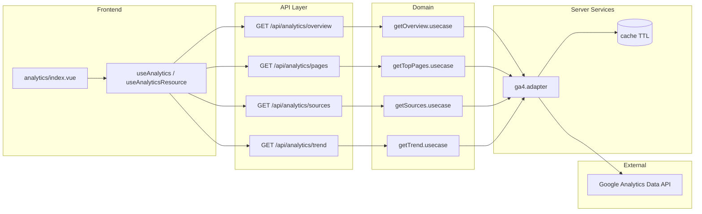

# Plan: Dashboard Analytics (GA4)

## 0. Zgodność z kontekstem technicznym

- **Nuxt 4 full-stack**: strona `app/pages/dashboard/analytics/index.vue`, API w `server/api/analytics/*`.
- **Warstwy**: brak fetch w komponentach; fetch tylko przez `app/composables/resources/useAnalyticsResource.ts`; `server/api/analytics/*` = parse → Valibot → use-case → DTO; logika w `domain/analytics/*`; DTO w `#shared/types` i schematy Valibot w `shared/schemas`.
- **Auth**: `requirePermission(event, PERMISSIONS.ANALYTICS_READ)` w każdym endpoincie; middleware strony dashboardu (już chroniony przez auth) + opcjonalna weryfikacja `analytics.read` w layout/middleware dla UX (np. ukrycie linku).
- **Nowe uprawnienie**: `ANALYTICS_READ: 'analytics.read'` w [shared/permissions.ts](shared/permissions.ts) + wpis w `PERMISSION_META` + seed w [prisma/seed.ts](prisma/seed.ts) (przypisanie do roli admin).

---

## 1. Strategia integracji Analytics

**Server-side integration (preferred):**

- **Frontend** wywołuje tylko własne API: `GET /api/analytics/overview`, `GET /api/analytics/pages`, `GET /api/analytics/sources` (z query: `dateFrom`, `dateTo`, opcjonalnie `period`).
- **Backend** (Nitro) wywołuje Google Analytics Data API (GA4) z użyciem Service Account: pobiera dane, mapuje na DTO aplikacji, zwraca JSON.

**Dlaczego nie łączymy się z GA z frontendu:**

- Klucze API / service account nie mogą trafić do klienta (bezpieczeństwo).
- GA Data API wymaga OAuth2 lub Service Account – w przeglądarce ujawniłoby to credentials.
- Jedna kontrola dostępu: nasze API + permission `analytics.read`; GA widzi tylko serwer.

**Credentials:**

- **Service Account** (JSON z Google Cloud Console): nie trzymać pliku w repo. Opcje:
  - **ENV**: zmienne `GA_CLIENT_EMAIL`, `GA_PRIVATE_KEY` (klucz jako string, np. base64 lub z nowymi liniami `\n`); albo jedna zmienna `GA_CREDENTIALS_JSON` (cały JSON jako string).
  - **Plik** (np. `server/secrets/ga-credentials.json`) – tylko poza repo, w `.gitignore`; odczyt w serwisie tylko na serwerze.
- **W runtimeConfig**: `runtimeConfig.analytics.gaPropertyId`, `runtimeConfig.analytics.gaCredentials` (server-only), `runtimeConfig.public.analyticsEnabled` (boolean, np. `false` w dev).

**Ograniczenie uprawnień:**

- Service Account w GA4: rola **Viewer** (tylko odczyt) dla właściwości; brak edycji konfiguracji ani dostępu do danych użytkowników poza zagregowanymi raportami.

**Alternatywa v2 (Plausible / inne źródła):**

- Abstrakcja: `domain/analytics` definiuje porty (interfejsy) np. `AnalyticsOverviewProvider`; `server/services/analytics/ga4.adapter.ts` implementuje dla GA4; później `plausible.adapter.ts` – ta sama kontrakt, inne źródło. Kontroler/use-case wybierają adapter na podstawie konfiguracji (np. `analytics.provider: 'ga4' | 'plausible'`).

---

## 2. Zakres danych (MVP)

| Metryka / raport   | Zakres dat                           | Agregacja                                                          | Uwagi / limity API                                                                                                |
| ------------------ | ------------------------------------ | ------------------------------------------------------------------ | ----------------------------------------------------------------------------------------------------------------- |
| **Overview**       | dateFrom – dateTo (max 30 dni w MVP) | Sesje, użytkownicy, pageviews (całość)                             | RunReport: dimensions puste lub `date`; metrics: `sessions`, `activeUsers`, `screenPageViews`.                    |
| **Top pages**      | j.w.                                 | Po stronie (path lub title)                                        | Dimension `pagePath` lub `pageTitle`; metric `screenPageViews`; sort desc; limit 10–20.                           |
| **Źródła ruchu**   | j.w.                                 | Po `sessionDefaultChannelGroup` lub `firstUserDefaultChannelGroup` | Dimension channel; metric sessions/users; limit 10.                                                               |
| **Trend (wykres)** | 7 lub 30 dni                         | Dziennie                                                           | Dimension `date`; metrics sesje/pageviews; zwracać tablicę `{ date, sessions, pageviews }` dla wykresu liniowego. |

- **Walidacja zakresu**: np. max 30 dni, dateFrom ≤ dateTo, daty nie w przyszłość.
- **Limity GA4**: 10 requestów na sekundę na property; w MVP brak równoległych requestów na użytkownika; opcjonalnie cache (patrz sekcja 3) zmniejszy liczbę wywołań.

---

## 3. API (server/api) — kontrakty

Wszystkie endpointy:

- **Auth**: `requirePermission(event, PERMISSIONS.ANALYTICS_READ)` (zwraca 403 przy braku uprawnienia).
- **Query**: walidacja Valibot (np. `AnalyticsQuerySchema`: `dateFrom`, `dateTo`, opcjonalnie `period: '7d' | '30d'`).
- **Odpowiedź**: zawsze `{ data: DTO }`; błędy w formacie z [ARCHITECTURE.md](content/docs/ARCHITECTURE.md) (`error: { code, message, status }`).
- **Błędy GA**: mapowanie na np. `ANALYTICS_PROVIDER_ERROR` (503 lub 502), bez eksponowania szczegółów GA w kliencie; logowanie pełnego błędu po stronie serwera.

Planowane endpointy:

| Metoda | Ścieżka                   | Query (Valibot)                                       | Odpowiedź (data)         |
| ------ | ------------------------- | ----------------------------------------------------- | ------------------------ |
| GET    | `/api/analytics/overview` | `dateFrom`, `dateTo` (ISO date), opcjonalnie `period` | `AnalyticsOverviewDTO`   |
| GET    | `/api/analytics/pages`    | j.w.                                                  | `AnalyticsTopPageDTO[]`  |
| GET    | `/api/analytics/sources`  | j.w.                                                  | `AnalyticsSourceDTO[]`   |
| GET    | `/api/analytics/trend`    | j.w.                                                  | `AnalyticsTimeSeriesDTO` |

Opcjonalnie: **cache** (in-memory lub Nitro storage) z TTL (np. 5–15 min) po stronie serwera, klucz np. `analytics:overview:${dateFrom}:${dateTo}`. Zmniejszy wywołania do GA i ryzyko rate limit. Cache invalidate przy zmianie zakresu dat.

---

## 4. Domain i serwisy

**domain/analytics/** (logika bez Google SDK):

- **getOverview.usecase.ts** – przyjmuje `AnalyticsQuery` (dateFrom, dateTo), wywołuje port `AnalyticsProvider.getOverview(query)` (interfejs), zwraca `Result<AnalyticsOverviewDTO, DomainError>`.
- **getTopPages.usecase.ts** – j.w., port `getTopPages(query)` → `AnalyticsTopPageDTO[]`.
- **getSources.usecase.ts** – port `getSources(query)` → `AnalyticsSourceDTO[]`.
- **getTrend.usecase.ts** – port `getTrend(query)` → `AnalyticsTimeSeriesDTO`.
- **analytics.types.ts** – interfejsy portów (provider), typy wejściowe `AnalyticsQuery`.

Zasada: domain nie importuje `@google-analytics/data` ani żadnego SDK; tylko interfejsy i DTO.

**server/services/analytics/**:

- **ga4.adapter.ts** – implementacja portów: odczyt credentials z runtimeConfig, wywołanie GA4 Data API (RunReport), mapowanie odpowiedzi GA na DTO aplikacji (np. `mapGaRunReportToOverviewDTO`). Używane tylko w Nitro.
- **mapper.ts** (opcjonalnie w tym samym lub osobnym pliku) – funkcje czyste GA response → DTO.
- **index.ts** – eksport adaptera; ewentualnie fabryka `getAnalyticsProvider()` zwracająca GA4 lub w v2 Plausible.

**Opcjonalnie cache service:**

- `server/services/analytics/cache.ts` – get/set z TTL; klucze jak wyżej. Wywoływane w use-case lub w adapterze przed wywołaniem GA.

---

## 5. Typy i schemy (#shared/types, shared/schemas)

**shared/types/analytics.ts** (lub w [shared/types/index.ts](shared/types/index.ts)):

- **AnalyticsOverviewDTO**: `{ users: number, sessions: number, pageviews: number }` (nazwy pól mogą być po angielsku, spójne z GA).
- **AnalyticsTimeSeriesDTO**: `{ points: { date: string, sessions: number, pageviews: number }[] }`.
- **AnalyticsTopPageDTO**: `{ path: string, title?: string, pageviews: number }`.
- **AnalyticsSourceDTO**: `{ channel: string, sessions: number, users?: number }`.

**shared/schemas/analytics.ts** (Valibot):

- **AnalyticsDateRangeSchema**: `dateFrom` (pipe string + regex ISO date), `dateTo` (j.w.), opcjonalnie custom validacja dateFrom ≤ dateTo i max 30 dni.
- **AnalyticsQuerySchema**: rozszerzenie o opcjonalne `period: picklist(['7d', '30d'])`; użyte do walidacji query w `server/api/analytics/*`.

Zasada: UI dostaje tylko te DTO; żadnych surowych pól z GA w odpowiedzi.

---

## 6. Frontend — resources + UI

**app/composables/resources/useAnalyticsResource.ts**:

- `getOverview(query)`, `getTopPages(query)`, `getSources(query)`, `getTrend(query)` – każdy wywołuje `apiClient.request<DTO>(url, { method: 'GET' })` z query jako searchParams. Brak fetch w komponentach; strona/komponenty wywołują tylko te metody (np. przez composable `useAnalytics()`, który trzyma stan i wywołuje resource).

**app/composables/useAnalytics.ts** (opcjonalnie, dla stanu i UX):

- Stan: `overview`, `topPages`, `sources`, `trend`, `isLoading`, `error`; metody `fetchOverview`, `fetchAll` (z jednym zakresem dat). Wywołania do `useAnalyticsResource`. Ustawianie zakresu dat (reactive) i refetch przy zmianie.

**Strona app/pages/dashboard/analytics/index.vue**:

- Layout: spójny z innymi podstronami dashboardu (np. [app/pages/dashboard/profile/index.vue](app/pages/dashboard/profile/index.vue)) – nagłówek, ewentualnie tabs jeśli w przyszłości rozbudowa.
- **AnalyticsFilters**: wybór zakresu dat (np. preset 7d / 30d + opcjonalnie custom); przycisk „Zastosuj”; emit lub v-model dla `dateFrom`/`dateTo`; bez fetch – tylko wartości przekazywane do rodzica, który wywołuje `useAnalytics().fetchAll(...)`.
- **AnalyticsKpiCard** (UCard): wyświetla pojedynczą metrykę (np. użytkownicy, sesje, pageviews); props: `label`, `value`, `icon`; skeleton gdy loading.
- **AnalyticsLineChart**: wykres trendu (7/30 punktów); props: `data: AnalyticsTimeSeriesDTO`; implementacja: Nuxt UI nie ma wbudowanego chart – użyć lekkiej biblioteki (np. Chart.js, ApexCharts) lub prosty SVG/CSS; motion-v: subtelne wejście.
- **AnalyticsTable**: tabela top pages lub sources; props: `items` (TopPageDTO[] lub SourceDTO[]), `columns`; UTable z Nuxt UI; empty state gdy brak danych.
- **Skeleton loading**: placeholdery dla KPI i tabel/wykresu; wyłączane gdy dane załadowane.
- **UAlert** (soft error): gdy `error` z useAnalytics; przycisk „Spróbuj ponownie” (refetch).
- Motion-v: wejście sekcji (np. `v-motion-fade`) dla KPI i wykresów; bez przesadnych animacji.

Spójność: kolorystyka, typografia i komponenty Nuxt UI jak na dashboardzie (profile, media); ta sama konwencja kart i odstępów.

---

## 7. Autoryzacja i bezpieczeństwo

- **Middleware strony**: Dashboard jest pod ścieżką chronioną (np. middleware auth w layout); dla analytics dodatkowo w samej stronie lub w layout sprawdzenie `useUserSession()` + czy użytkownik ma `analytics.read` (np. z `useAuth().user.permissions`) – przy braku uprawnienia: `navigateTo('/dashboard')` lub 403 (jeśli wejście bezpośrednio przez API).
- **Server-side**: każdy endpoint `server/api/analytics/*` na początku `requirePermission(event, PERMISSIONS.ANALYTICS_READ)`; brak zwracania danych bez tego sprawdzenia.
- **Brak ekspozycji kluczy GA**: credentials tylko w `runtimeConfig` po stronie serwera (nie w `runtimeConfig.public`); żadna zmienna z kluczem/JSONem w bundle klienta.
- **Obsługa błędów GA**: timeout, quota exceeded, 401/403 od GA – mapowanie na jeden kod aplikacyjny (np. `ANALYTICS_PROVIDER_ERROR`) i ogólny komunikat dla użytkownika; szczegóły tylko w logach serwera.

---

## 8. Konfiguracja i ENV

- **GA_PROPERTY_ID** – ID właściwości GA4 (np. `123456789`); w `runtimeConfig.analytics.gaPropertyId`.
- **GA credentials** – opcja A: `GA_CLIENT_EMAIL`, `GA_PRIVATE_KEY` (klucz z `\n` jako prawdziwe nowe linie lub base64); opcja B: `GA_CREDENTIALS_JSON` (cały JSON service account). W Nitro: odczyt w `server/services/analytics/ga4.adapter.ts` z `useRuntimeConfig().analytics`.
- **ANALYTICS_ENABLED** (opcjonalnie) – flaga wyłączająca wywołania do GA (np. w dev); gdy `false`, API może zwracać puste DTO lub 503 z kodem `ANALYTICS_DISABLED`.
- **Public**: `runtimeConfig.public.analyticsEnabled` – tylko boolean do ukrycia/pokazania sekcji Analytics w menu dashboardu (bez ujawniania GA).

Dokumentacja: w README lub `.env.example` opis zmiennych bez podawania wartości.

---

## 9. Rozszerzalność (v2)

- **Porównanie zakresów dat**: drugi zakres w query (np. `dateFrom2`, `dateTo2`); osobny endpoint lub rozszerzenie overview/trend o pole `comparison`; UI: dwa wykresy lub delta (np. +X%).
- **Własne eventy (custom events)**: GA4 custom events jako wymiar/metric; nowy endpoint np. `GET /api/analytics/events`; DTO i filtr po nazwie eventu.
- **Inne źródła (Plausible)**: adapter `plausible.adapter.ts` implementujący te same porty co GA4; konfiguracja `analytics.provider: 'plausible'`; Plausible API key w ENV (server-only). [nuxt.config.ts](nuxt.config.ts) ma już `plausibleDomain` w public – można go wykorzystać po stronie serwera z API key.
- **Eksport CSV/PDF**: endpoint `GET /api/analytics/export?format=csv&...` z tymi samymi query; zwrot pliku; lub generowanie PDF po stronie serwera (biblioteka PDF).
- **Webhook / background refresh**: np. cron (Nitro scheduled) co 15 min zapisujący overview do cache lub do Prisma (tabela `AnalyticsCache`); API najpierw z cache, ewentualnie „refresh” wymuszający odświeżenie.

---

## 10. Deliverables – podsumowanie

### 1) Architektura integracji (diagram)

### 2) Lista endpointów + DTO

| Endpoint                    | Query                     | DTO                    |
| --------------------------- | ------------------------- | ---------------------- |
| GET /api/analytics/overview | dateFrom, dateTo, period? | AnalyticsOverviewDTO   |
| GET /api/analytics/pages    | dateFrom, dateTo, period? | AnalyticsTopPageDTO[]  |
| GET /api/analytics/sources  | dateFrom, dateTo, period? | AnalyticsSourceDTO[]   |
| GET /api/analytics/trend    | dateFrom, dateTo, period? | AnalyticsTimeSeriesDTO |

### 3) Plan domain/services

- **domain/analytics**: getOverview, getTopPages, getSources, getTrend (use-case'y); analytics.types (porty providera).
- **server/services/analytics**: ga4.adapter.ts (implementacja portów, wywołanie GA Data API, mapowanie na DTO); mapper; opcjonalnie cache.ts.

### 4) Plan UI Dashboard Analytics

- Strona: `app/pages/dashboard/analytics/index.vue`.
- Komponenty: AnalyticsFilters, AnalyticsKpiCard, AnalyticsLineChart, AnalyticsTable (w `app/components/Dashboard/Analytics/` lub w tym samym katalogu co strona).
- Composable: useAnalyticsResource (API), useAnalytics (stan + fetch).
- UX: skeleton, empty state, UAlert przy błędzie, motion-v wejście.

### 5) ENV i bezpieczeństwo

- ENV: GA_PROPERTY_ID, GA_CLIENT_EMAIL + GA_PRIVATE_KEY lub GA_CREDENTIALS_JSON; ANALYTICS_ENABLED (opcjonalnie).
- Public: tylko analyticsEnabled (boolean).
- Zasady: credentials tylko server-side; requirePermission(ANALYTICS_READ); mapowanie błędów GA na ogólne kody; brak logowania credentials.

### 6) Checklista wdrożenia MVP

1. Dodać `ANALYTICS_READ` do [shared/permissions.ts](shared/permissions.ts) i PERMISSION_META; zaseedować w prisma/seed i przypisać do roli admin.
2. Zdefiniować DTO i Valibot schemas w shared/types i shared/schemas (analytics).
3. Zaimplementować porty (interfejsy) w domain/analytics i use-case'y wywołujące port.
4. Zaimplementować ga4.adapter (credentials z config, GA Data API, mapper do DTO).
5. Dodać runtimeConfig.analytics (gaPropertyId, credentials), public.analyticsEnabled.
6. Endpointy GET /api/analytics/overview, pages, sources, trend z requirePermission i walidacją query.
7. useAnalyticsResource + opcjonalnie useAnalytics.
8. Strona dashboard/analytics + komponenty (Filters, KpiCard, LineChart, Table); skeleton i UAlert.
9. Link do Analytics w menu dashboardu (warunkowy po analyticsEnabled i permission).
10. Testy: ręcznie z uprawnionym użytkownikiem; opcjonalnie test jednostkowy use-case'ów z mockiem providera.

### 7) Plan rozszerzeń v2

- Porównanie dwóch zakresów dat (overview/trend).
- Custom events (endpoint + filtr).
- Adapter Plausible (ten sam kontrakt, inny provider).
- Eksport CSV/PDF.
- Cache w DB lub Nitro storage + scheduled refresh / webhook.
