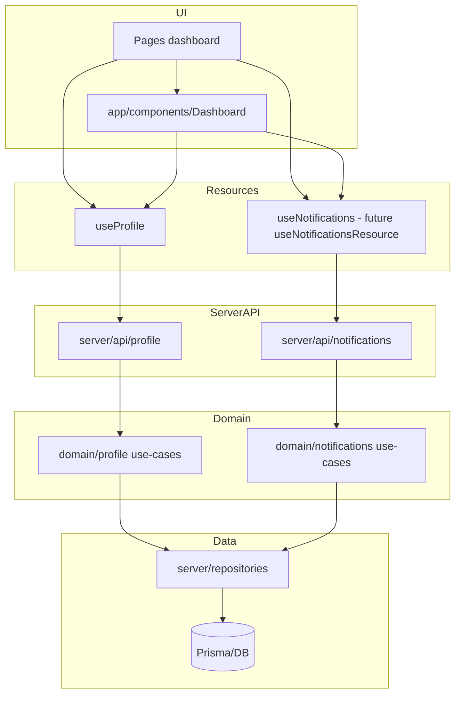

# Plan integracji Dashboard

## 1. Diagram zależności

Zasada: **UI nigdy nie zna ścieżek endpointów** — tylko resources wywołują `apiClient.request('/api/...')`.

---

## 2. Lista FIXME (P0 / P1 / P2)

| Priorytet | Plik                                                                                                               | Problem                                                                                                                                                                                             | Proponowana naprawa                                                                                                                        |
| --------- | ------------------------------------------------------------------------------------------------------------------ | --------------------------------------------------------------------------------------------------------------------------------------------------------------------------------------------------- | ------------------------------------------------------------------------------------------------------------------------------------------ |
| **P0**    | app/composables/resources/useProfile.ts                                                                            | Import Profile, ProfileStats, ProfileContent, UpdateProfilePayload itd. z #shared/types — typy nie istnieją; wywołania /profile zamiast /api/profile/me; response.user vs response.data niespójność | Dodać typy w shared/types (ProfileDTO, UpdateProfileInput itd.); zmienić ścieżki na /api/profile/me; ujednolicić zwrot z API (zawsze data) |
| **P0**    | app/components/Dashboard/User/DashboardUserMenuTrigger.vue                                                         | User, Profile — brak w shared                                                                                                                                                                       | Użyć UserDTO / ProfileDTO z shared po ich dodaniu                                                                                          |
| **P0**    | app/components/Dashboard/Profile/Update/.vue                                                                       | UpdateProfilePayload, UpdatePasswordPayload, UpdatePrivacyPayload — brak                                                                                                                            | Dodać w shared (np. UpdateProfileInput) i użyć w komponentach                                                                              |
| **P1**    | app/components/Dashboard/Widget/DashboardWidgetChart.vue                                                           | Record<string, any>                                                                                                                                                                                 | Zdefiniować typ dla danych wykresu (np. ChartDataPoint[]) w shared                                                                         |
| **P1**    | app/components/Dashboard/Toolbar/DashboardToolbarFilters.vue                                                       | Record<string, any> (filtry)                                                                                                                                                                        | Zdefiniować DashboardFilters / FilterOption[] w shared                                                                                     |
| **P2**    | useProfile: FetchSecurityPayload, FetchStatsPayload, FetchContentPayload, UploadAvatarPayload, DeleteAvatarPayload | Brak typów                                                                                                                                                                                          | Dodać w P0/P1 razem z resztą DTO profile                                                                                                   |

---

## 3. Routes i layout Dashboard

**Layout:** app/layouts/dashboard.vue — już używa UDashboardGroup, DashboardSidebar, UDashboardSearch. Wystarczy uzupełnić slot o Navbar (topbar) jeśli potrzebny.

**Proponowane trasy MVP:**

| Route                    | Opis                     | Middleware |
| ------------------------ | ------------------------ | ---------- |
| /dashboard               | Strona główna            | auth       |
| /dashboard/profile       | Profil użytkownika       | auth       |
| /dashboard/notifications | Lista powiadomień        | auth       |
| /dashboard/settings      | (Opcjonalnie) Ustawienia | auth       |

**Ochrona:** middleware auth w definePageMeta; API chronione po stronie serwera (sesja).

---

## 4. Composables Dashboard — role i kontrakty

| Composable             | Odpowiedzialność                                                                      | Zwracane API           |
| ---------------------- | ------------------------------------------------------------------------------------- | ---------------------- |
| useDashboard           | Stan UI: sidebarCollapsed, currentPage; toggleSidebar, setCurrentPage                 | Ref/akcje              |
| useDashboardNavigation | Źródło prawdy dla menu i aktywnej sekcji (z useRoute)                                 | menuItems: ComputedRef |
| useDashboardSearch     | Źródło prawdy dla wyszukiwarki (command palette)                                      | groups: ComputedRef    |
| useNotifications       | Lista, unread count, fetch, markAsRead, markAllAsRead; docelowo resource wywołuje API | typy z #shared/types   |

**Spójność:** Nawigacja — menuItems; Wyszukiwarka — groups; Notifications — useNotificationsResource + useNotifications (stan).

---

## 5. Backend (MVP)

### Profile

- GET /api/profile/me — zwraca ProfileDTO (z sesji)
- PATCH /api/profile/me — UpdateProfileInputSchema (Valibot), zwraca ProfileDTO
- Use-case: getProfileByUserId, updateProfile; repo: user.repo (findById, updateProfile)

### Notifications

- Model Prisma: Notification (userId, type, title, message, read, actionUrl, createdAt)
- GET /api/notifications — NotificationsListDTO (items + unreadCount)
- PATCH /api/notifications/read — body: ids?, all?; zwraca { updated: number }
- Use-case: listNotifications, markNotificationsRead; repo: notification.repo

---

## 6. Notifications — plan (HTTP + WebSocket)

### Etap 1 — MVP (HTTP)

- Listowanie, unread count, oznaczanie jako przeczytane przez GET/PATCH.

### Etap 2 — v2 WebSocket (Nitro)

- Endpoint WS (np. /api/ws/notifications); autoryzacja; rooms per user (user:); publish przy utworzeniu notification; klient: useNotificationsSocket() (VueUse useWebSocket); reconnect/backoff; wss:// w produkcji; prefer-reduced-motion po stronie UI.

---

## 7. Typy w #shared/types

- ProfileDTO, UpdateProfileInput, UpdatePrivacyInput, UpdatePasswordInput
- NotificationDTO, NotificationsListDTO
- ApiErrorDTO, ApiSuccessResponse, ApiErrorResponse
- ChartData, DashboardFiltersValue (widget/toolbar)

---

## 8. Priorytety wdrożenia

### P0

- Typy + useProfile (ścieżki/zwroty) + komponenty User/Profile + minimalny backend profile/notifications + Prisma Notification.

### P1

- Strony dashboard/profile.vue, dashboard/notifications.vue; nawigacja sidebar + useDashboardSearch (Profil, Powiadomienia).

### P2

- v2 Notifications (WebSocket); 2FA (useProfile2FA).
