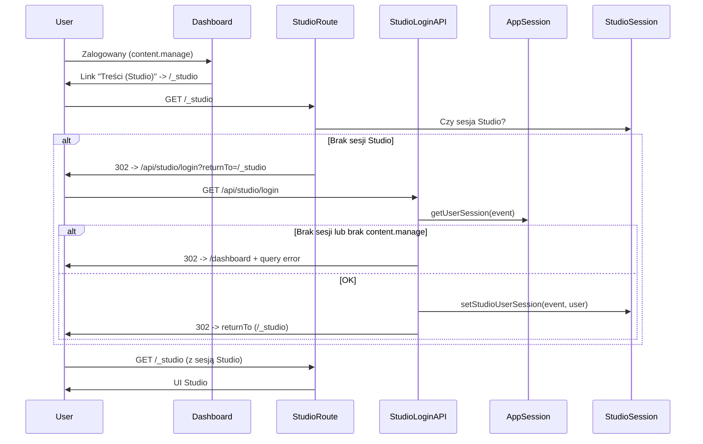

# Plan wdrożenia Nuxt Studio (Admin / content.manage)

## Architektura dostępu



---

## 1. Konfiguracja Studio w nuxt.config.ts

**Plik:** [nuxt.config.ts](nuxt.config.ts)

Dodać blok `studio` (bez sekretów; PAT i repo szczegóły w ENV):

```ts
studio: {
  route: '/_studio',
  repository: {
    provider: 'github',  // lub 'gitlab'
    owner: process.env.STUDIO_GIT_OWNER || 'your-org',
    repo: process.env.STUDIO_GIT_REPO || 'your-repo',
    branch: process.env.STUDIO_GIT_BRANCH || 'main'
    // rootDir: '' — tylko jeśli content w podkatalogu (np. monorepo)
  },
  i18n: {
    defaultLocale: 'pl'
  },
  // Custom Auth — nie ustawiać STUDIO_GITHUB_CLIENT_ID / STUDIO_GOOGLE_* itd.
  // meta.components — opcjonalnie na v2, jeśli trzeba ograniczyć listę komponentów w Studio
}
```

Uwagi:

- `owner`/`repo`/`branch` można w produkcji wczytać z ENV, żeby nie trzymać nazw repo w repo.
- Trasa `/_studio` — bez kolizji z `/dashboard/admin` (panel admina aplikacji).
- `studio.meta.components` (include/exclude) — opcjonalnie w v2, jeśli Studio pokazuje za dużo komponentów; na MVP nie wymagane.

---

## 2. Custom Auth Studio (endpointy + flow)

### 2.1 Kontrakty endpointów

**GET /api/studio/login**

- **Cel:** Wejście do Studio na podstawie sesji aplikacji i uprawnienia `content.manage`.
- **Query (opcjonalne):** `returnTo` — URL po zalogowaniu (domyślnie `/_studio`).
- **Flow:**
  1. Odczyt sesji aplikacji: `getUserSession(event)` (nuxt-auth-utils).
  2. Brak sesji → redirect `302` na `/dashboard?studio=login_required` (lub `/auth/login?redirect=...`).
  3. Sprawdzenie uprawnienia: `user.permissions` zawiera `content.manage` (albo użycie `requirePermission(event, PERMISSIONS.CONTENT_MANAGE)` i catch 403).
  4. 403 → redirect `302` na `/dashboard?studio=forbidden`.
  5. Sukces: `setStudioUserSession(event, { name, email, providerId: user.id, avatar })` (import z modułu Studio).
  6. Redirect `302` na `returnTo` lub `/_studio`.
- **Uzasadnienie GET:** Użytkownik wchodzi linkiem z dashboardu („Treści (Studio)”); jeden klik = GET + redirect. Brak formularza hasła — logowanie przez istniejącą sesję.
- **Błędy:** 401/403 przez redirect z query (`studio=login_required` / `studio=forbidden`), nie JSON.

**POST /api/studio/logout**

- **Cel:** Wylogowanie z Studio, wyczyszczenie sesji Studio.
- **Flow:** `clearStudioUserSession(event)` (import z modułu Studio), zwrot `{ ok: true }` lub redirect `302` na `/dashboard`.
- **Uwaga:** Sesja aplikacji (nuxt-auth-utils) pozostaje; wylogowujemy tylko Studio.

### 2.2 Pliki do dodania

| Plik                               | Rola                                                                                     |
| ---------------------------------- | ---------------------------------------------------------------------------------------- |
| `server/api/studio/login.get.ts`   | Handler GET: sesja app → sprawdzenie `content.manage` → setStudioUserSession → redirect. |
| `server/api/studio/logout.post.ts` | Handler POST: clearStudioUserSession, zwrot lub redirect.                                |

W `server/middleware/auth.ts` dodać do `publicPaths`: `/api/studio/login` (GET musi być dostępny bez wymagania sesji app tylko jeśli chcemy pokazać „zaloguj się” — w naszym flow użytkownik zawsze najpierw jest w dashboardzie, więc login Studio **wymaga** sesji app; **nie** dodawać `/api/studio/login` do publicPaths — wtedy niezalogowany dostanie 401 z middleware auth, co jest OK). Faktycznie: użytkownik klika „Treści (Studio)” będąc zalogowanym; jeśli wygaśnie sesja app, GET /api/studio/login i tak zwróci 401 z auth middleware — OK. Więc **nie** dodawać `/api/studio/login` do publicPaths.

---

## 3. Ochrona dostępu do studio.route (/\_studio)

**Problem:** Wejście na `/_studio` bez sesji Studio musi skończyć się przekierowaniem do logowania Studio (nasz endpoint), a nie pokazaniem UI Studio.

**Rozwiązanie:** Nitro middleware uruchamiane dla ścieżek `/_studio` i ewentualnie `__nuxt_studio` (jeśli Studio pod spodem używa takiego prefiksu): przed obsługą żądania sprawdzić, czy istnieje sesja Studio (API udostępniane przez moduł nuxt-studio, np. `getStudioUserSession(event)` lub równoważne). Jeśli nie ma sesji → `sendRedirect(event, '/api/studio/login?returnTo=' + encodeURIComponent(event.path))`.

**Plik do dodania:** `server/middleware/studio-guard.ts` (lub w jednym pliku middleware sprawdzającym path).

- Warunek: `event.path.startsWith('/_studio')` (i ewentualnie wewnętrzne ścieżki Studio, jeśli dokumentacja wskaże).
- Jeśli brak sesji Studio → redirect na `/api/studio/login?returnTo=/_studio`.
- Middleware Nitro w `server/middleware/` działa przed routowaniem; trzeba upewnić się, że Studio nie obsługuje `/_studio` wcześniej — jeśli Studio rejestruje route po stronie Nitro, kolejność może wymagać konfiguracji (np. prefix). Alternatywa: hook Nitro `request` — w planie przyjmujemy middleware i w razie konfliktu dokumentacja modułu Studio / hook `studio:auth` mogą posłużyć do doprecyzowania.

**Minimalny flow:**

1. Request GET `/_studio`.
2. Middleware: brak sesji Studio → 302 na `/api/studio/login?returnTo=/_studio`.
3. Login GET: sesja app + content.manage → setStudioUserSession → 302 na `/_studio`.
4. Ponowne GET `/_studio` — sesja Studio jest → Studio renderuje UI.

---

## 4. Git w produkcji (publikacja zmian)

- **PAT:** Token serwisowy (np. konto „studio-bot” lub dedykowany token) z minimalnym scope: repo (read+write) dla danego repozytorium.
- **ENV (tylko serwer):**
  - GitHub: `STUDIO_GITHUB_TOKEN` (np. fine-grained: Contents read/write).
  - GitLab: `STUDIO_GITLAB_TOKEN`.
- **Dev vs prod:**
  - Dev: brak PAT; edycje zapisują lokalnie do `content/` (Studio w trybie dev).
  - Prod: ustawiony PAT; przy „Publish” Studio wykonuje commit + push do skonfigurowanego repo/branch.
- **Bezpieczeństwo:** Token tylko w `runtimeConfig` / ENV po stronie serwera; nigdy w bundle klienta. W `nuxt.config` nie wpisywać wartości tokenu — tylko `process.env.STUDIO_GITHUB_TOKEN` w runtime.

---

## 5. Integracja w Dashboard (menu + ewentualna strona pośrednia)

### 5.1 Rozszerzenie menu

- **Plik:** [app/utils/dashboardNavigation.ts](app/utils/dashboardNavigation.ts)
  - W `DashboardMenuOptions` dodać pole opcjonalne: `hasContentManage?: boolean`.
  - W `baseItems` dodać pozycję (np. po „Media”):  
    `{ label: 'Treści (Studio)', icon: 'i-lucide-file-edit', to: '/_studio', active: false }`  
    (lub `to: '/dashboard/content'` jeśli wybierzemy stronę pośrednią).
  - W `filteredItems`: filtrować tę pozycję: pokazywać tylko gdy `hasContentManage === true` (jeśli brak flagi, nie pokazywać).
- **Plik:** [app/composables/useDashboardNavigation.ts](app/composables/useDashboardNavigation.ts)
  - Przy wywołaniu `getDashboardMenuItems` dodać: `hasContentManage: can(PERMISSIONS.CONTENT_MANAGE)`.
  - W ten sposób „Treści (Studio)” widzi tylko użytkownik z `content.manage`.

Zasada: jedna nowa pozycja, bez przebudowy całego menu; spójna z istniejącym wzorcem (hasAdminRole, showAnalytics).

### 5.2 Strona pośrednia (opcjonalnie MVP)

- **Plik:** `app/pages/dashboard/content/index.vue`
  - Meta: `middleware: ['auth']`, `permission: PERMISSIONS.CONTENT_MANAGE` (albo ręcznie `can('content.manage')` i redirect).
  - Zawartość: krótki opis („Edycja treści w Nuxt Studio”), przycisk „Otwórz Studio” → `/_studio`.
  - Opcjonalnie: lista sekcji (Strona główna, Oferta, O nas, Kontakt, Blog, Portfolio) z linkami do odpowiednich plików/ścieżek w Studio (jeśli Studio udostępnia deep linki do plików).
  - Jeśli MVP bez strony pośredniej: link w menu prowadzi od razu do `/_studio`.

---

## 6. Zakres treści (kolekcje Content)

- **pages** (`content/*.md`): index, oferta, o-nas, kontakt — już w [content.config.ts](content.config.ts) z `PageSchema`; Studio będzie edytował te pliki.
- **blog** (`content/blog/*.md`): schemat `BlogPostSchema` — bez zmian.
- **portfolio** (`content/portfolio/*.md`): schemat `PortfolioProjectSchema` — bez zmian.
- **app** (opcjonalnie): `content/app/footer.md` — FooterConfigSchema.
- **legal** (opcjonalnie): `content/legal/**/*.md` — LegalPageSchema.

Na MVP nie ograniczać pól w schematach; ewentualne ograniczenia (np. tylko wybrane pola w Studio) w v2 przez `studio.meta.components` lub konfigurację formularzy, jeśli moduł to wspiera.

---

## 7. Studio Media vs Media DB (MVP)

- **MVP:** Równolegle.
  - **Studio Media:** tylko na potrzeby treści Content (obrazy w `content/` lub `public/` w ramach commitów Studio).
  - **Media DB:** bez zmian — dashboard, upload, powiązania z encjami aplikacji.
- **Brak** w MVP: wspólnego uploadu, synchronizacji między systemami.
- **TODO v2:** „Unifikacja mediów (Studio vs Media DB)” — zapis w `.cursor/todo/` lub w planie v2.

---

## 8. Ryzyka i decyzje

| Ryzyko / temat                   | Decyzja                                                                                                                                                 |
| -------------------------------- | ------------------------------------------------------------------------------------------------------------------------------------------------------- |
| Konflikt tras `/admin` vs Studio | Studio pod `/_studio`; panel admina pod `/dashboard/admin`. Brak kolizji.                                                                               |
| Dwa auth (app + Studio)          | Custom Auth: logowanie do Studio = jedna akcja (GET /api/studio/login) przy istniejącej sesji app i `content.manage`; sesja Studio ustawiana przez nas. |
| SSR                              | Wymagane dla auth Studio (Nitro); aplikacja już na Nitro/SSR.                                                                                           |
| PAT w produkcji                  | Wymagany do pushy; token serwisowy, scope ograniczony do repo; tylko server-side ENV.                                                                   |

---

## 9. Test plan (MVP)

- Użytkownik niezalogowany: brak linku „Treści (Studio)”;
  - wejście bezpośrednio na `/_studio` → redirect na login Studio → brak sesji app → redirect na dashboard/auth z komunikatem.
- User z `CONTENT_READ` (bez `CONTENT_MANAGE`): link „Treści (Studio)” niewidoczny;
  - wejście na `/_studio` → redirect na `/api/studio/login` → 403 → redirect na `/dashboard?studio=forbidden`.
- Admin z `CONTENT_MANAGE`: link widoczny;
  - klik „Treści (Studio)” → GET /api/studio/login → setStudioUserSession → redirect na `/_studio` → UI Studio;
  - edycja pliku z `pages` / `blog` / `portfolio` — zapis lokalny (dev);
  - wylogowanie Studio (POST /api/studio/logout) → brak sesji Studio → ponowne wejście na `/_studio` wymaga ponownego kliknięcia linku (login).
- Produkcja: po ustawieniu PAT — „Publish” w Studio wykonuje commit i push do repo.

---

## 10. Checklista deploy (PAT, ENV, bezpieczeństwo)

- Utworzenie tokenu PAT (GitHub lub GitLab) z minimalnym scope (repo contents).
- ENV produkcji: `STUDIO_GITHUB_TOKEN` lub `STUDIO_GITLAB_TOKEN` (tylko na serwerze).
- ENV opcjonalne: `STUDIO_GIT_OWNER`, `STUDIO_GIT_REPO`, `STUDIO_GIT_BRANCH` jeśli repo w config z ENV.
- Brak wpisów OAuth Studio (np. `STUDIO_GITHUB_CLIENT_ID`) przy użyciu wyłącznie Custom Auth.
- Weryfikacja, że token nie trafia do bundle (runtimeConfig private).
- SSR/hybrid: trasy `/_studio` i `/api/studio/*` nie prerenderowane.

---

## 11. Notatka do .cursor/remember.md (Studio access)

Dodać krótką sekcję:

- Dostęp do Nuxt Studio (`/_studio`) tylko dla użytkowników z uprawnieniem `content.manage`.
- Logowanie do Studio: Custom Auth — GET `/api/studio/login` (sesja aplikacji + `content.manage` → setStudioUserSession).
- Wejście z dashboardu: pozycja menu „Treści (Studio)” (widoczna gdy `can('content.manage')`).
- Media: na MVP Studio Media i Media DB działają równolegle; unifikacja ewentualna w v2.

---

## Deliverables – lista plików

| Akcja           | Plik                                                                                                                       |
| --------------- | -------------------------------------------------------------------------------------------------------------------------- |
| Zmiana          | [nuxt.config.ts](nuxt.config.ts) — blok `studio`                                                                           |
| Dodanie         | `server/api/studio/login.get.ts`                                                                                           |
| Dodanie         | `server/api/studio/logout.post.ts`                                                                                         |
| Dodanie         | `server/middleware/studio-guard.ts` (ochrona `/_studio`)                                                                   |
| Zmiana          | [app/utils/dashboardNavigation.ts](app/utils/dashboardNavigation.ts) — opcja `hasContentManage`, pozycja „Treści (Studio)” |
| Zmiana          | [app/composables/useDashboardNavigation.ts](app/composables/useDashboardNavigation.ts) — przekazanie `hasContentManage`    |
| Opcjonalnie MVP | `app/pages/dashboard/content/index.vue` (strona pośrednia)                                                                 |
| Zmiana          | [.cursor/remember.md](.cursor/remember.md) — sekcja Studio access                                                          |

---

## Fazy wdrożenia (P1 / P2 / P3)

**P1 (MVP – wejście do Studio i edycja):**

- Konfiguracja `studio` w nuxt.config (route, repository, i18n).
- Endpointy `/api/studio/login` (GET), `/api/studio/logout` (POST).
- Middleware ochrony `/_studio` (redirect na login przy braku sesji Studio).
- Menu dashboardu: „Treści (Studio)” z gatingiem `content.manage`.
- Notatka w remember.md.

**P2 (Produkcja i publikacja):**

- PAT w ENV produkcji; weryfikacja commit/push z Studio.
- Checklista deploy; obsługa query `studio=forbidden` / `studio=login_required` na stronie dashboardu (np. UAlert).

**P3 (opcjonalnie v2):**

- Strona `dashboard/content` z listą sekcji i linkami.
- Ograniczenie komponentów Studio (`studio.meta.components`) jeśli potrzebne.
- TODO „Unifikacja mediów” w backlogu.
