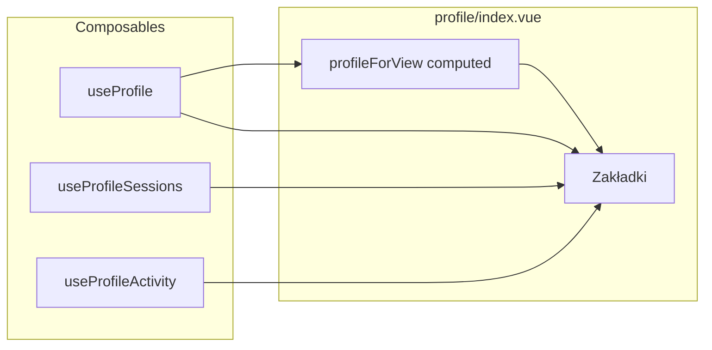

# Plan integracji dashboard/profile/index.vue z aplikacją

## 1. Kontekst i problemy

Strona [app/pages/dashboard/profile/index.vue](app/pages/dashboard/profile/index.vue) ma ok. 2205 linii i 7 zakładek (Overview, Settings, Activity, Content, Privacy, Security, Account). Obecnie:

- **Konflikt routingu:** Istnieją dwa wejścia pod `/dashboard/profile`:
  - [app/pages/dashboard/profile.vue](app/pages/dashboard/profile.vue) — prosty widok (Dane podstawowe, Hasło, Prywatność)
  - [app/pages/dashboard/profile/index.vue](app/pages/dashboard/profile/index.vue) — pełny widok z zakładkami  
    W Nuxt dla tej samej ścieżki zwykle wygrywa plik `profile.vue`, więc **index.vue może w ogóle nie być serwowany**.
- **Brakujące composables:** Strona używa `useProfileSessions()` i `useProfileActivity()` — **nie istnieją** w projekcie (błąd w runtime).
- **Niezgodność kształtu profilu:** index.vue oczekuje pól w stylu Laravel/snake_case i rozszerzeń, których nie ma w `ProfileDTO`:
  - Oczekiwane: `avatar_url`, `first_name`, `last_name`, `full_name`, `profile_completeness`, `profile_visibility`, `roles` (tablica), `created_at`, `email_verified_at`, `bio`
  - ProfileDTO (obecnie): `id`, `email`, `username`, `name`, `avatarUrl`, `role`, `emailVerifiedAt`
- **Brakujące API:** Strona wywołuje z useProfile: `fetchSecurity()`, `fetchStats()`, `fetchContent()`. Endpointy `/api/profile/security`, `/api/profile/stats`, `/api/profile/content` **nie istnieją** (404). Dane z sesji i aktywności też nie mają backendu.

---

## 2. Rozstrzygnięcie routingu

**Rekomendacja:** Jedna strona profilu pod `/dashboard/profile`.

- **Opcja A (rekomendowana):** Usunąć [app/pages/dashboard/profile.vue](app/pages/dashboard/profile.vue) i zostawić tylko [app/pages/dashboard/profile/index.vue](app/pages/dashboard/profile/index.vue). W Nuxt `pages/dashboard/profile/index.vue` obsługuje trasę `/dashboard/profile`. Obecna treść prostego profile.vue (sekcje Information, Password, Privacy) jest już zawarta w index.vue w zakładkach Settings/Privacy/Security — po integracji index.vue stanie się jedynym widokiem profilu.
- **Opcja B:** Przenieść całą logikę i szablon z index.vue do profile.vue i usunąć folder `profile/` (jedna duża strona w jednym pliku).

Konsekwencja: nawigacja w sidebarze i linki do „Profil” (`/dashboard/profile`) muszą wskazywać na ten jeden widok.

---

## 3. Composables — useProfileSessions i useProfileActivity

Obecnie wywołania tych funkcji powodują błąd (composable nie istnieje).

**Propozycja (MVP):**

- Dodać **useProfileSessions** w `app/composables/useProfileSessions.ts`:
  - Zwracać: `sessions`, `recentLogins`, `currentSession`, `otherSessions` (ref/computed z pustymi tablicami lub jednym placeholderem „current”),
  - `fetchSessions`, `fetchRecentLogins`, `logoutOtherSessions` — na razie no-op lub ustawienie pustych danych (bez wywołań API do czasu backendu).
  - Typy: zdefiniować minimalne interfejsy (np. `Session`, `RecentLogin`) w `shared/types` lub lokalnie w composable.
- Dodać **useProfileActivity** w `app/composables/useProfileActivity.ts`:
  - Zwracać: `logs`, `stats`, `isLoading`, `fetchLogs`, `fetchStats`, `getActionLabel`, `getActionIcon`, `getActionColor`.
  - MVP: `logs` = pusta tablica, `stats` = obiekt z zerami, fetch no-op, helpery (getActionLabel itd.) — proste mapowanie np. `action type -> label/icon/color` (stałe lub obiekt), żeby template się nie wywalał.

Dzięki temu strona się ładuje i zakładki Activity/Security nie rzucają błędów; później można podpiąć prawdziwe API bez zmiany kontraktu w index.vue.

---

## 4. Mapowanie ProfileDTO na kształt oczekiwany przez index.vue

Zamiast zmieniać cały szablon (setki wystąpień), wprowadzić **warstwę mapowania** w tej samej stronie (computed lub mały composable tylko na potrzeby widoku):

- **Jedna computed** (np. `profileForView`) zwracająca obiekt w kształcie oczekiwanym przez template:
  - `avatar_url` ← `profile.value?.avatarUrl`
  - `first_name` / `last_name` / `full_name` ← rozbicie `profile.value?.name` (np. pierwsze słowo / reszta, lub całość w `full_name`)
  - `email_verified_at` ← `profile.value?.emailVerifiedAt`
  - `profile_completeness` ← obliczenie na podstawie wypełnionych pól (np. name, avatarUrl) lub 0
  - `profile_visibility` ← `'public'` (domyślnie), dopóki API nie zwraca
  - `roles` ← `profile.value?.role` → `[{ slug: role, name: role }]` (jedna rola)
  - `created_at` ← brak w API → `undefined` (w template już jest `profile?.created_at ? ... : 'N/A'`)
  - `bio` ← brak w API → `undefined` lub `''`

W template index.vue **zamienić** wszystkie odwołania `profile` (tam gdzie chodzi o dane z API) na `profileForView` (albo użyć tego samego nazewnictwa przez alias w script). Dzięki temu:

- Backend i useProfile pozostają przy ProfileDTO (camelCase, obecne API).
- Strona dostaje jeden, spójny obiekt „pod szablon” bez rozjeżdżania się typów i bez zmiany setek atrybutów w HTML.

Opcjonalnie: jeśli w przyszłości API zwróci więcej pól (np. `profile_visibility`, `created_at`), rozszerzyć ProfileDTO i uzupełnić mapowanie w `profileForView`.

---

## 5. content, stats, fetchSecurity — brakujące API

- **fetchStats / fetchContent:** useProfile już je eksponuje, ale wywołania idą na nieistniejące endpointy. W **useProfile** (MVP):
  - Albo nie wywoływać tych metod w ogóle z index.vue do czasu backendu (wtedy `content`/`stats` zostają puste),
  - Albo w implementacji fetchStats/fetchContent przy błędzie (404) ustawiać lokalnie „pusty” kształt (np. `stats.value = { ... }`, `content.value = { recent_articles: [], recent_media: [], recent_comments: [], stats: { total_articles: 0, ... } }`), żeby computed `userContent` i ewentualne `v-for` nie rzucały błędów.
- **fetchSecurity:** Analogicznie — albo nie wywoływać, albo przy 404 ustawić `securityInfo.value = null` i polegać na optional chaining w template (`securityInfo?....`). Typ: zamienić `ref<any>` na `ref<SecurityInfo | null>` z prostym interfejsem `SecurityInfo` (np. w `shared/types`), z polami używanymi w template (email_verified, password_strength, two_factor_enabled, active_sessions_count, last_password_change, failed_login_attempts, account_type, roles, failed_login_attempts_recent).

---

## 6. Spójność z istniejącymi komponentami

- W zakładce **Settings** index.vue może używać tych samych komponentów co usunięty profile.vue: [DashboardProfileUpdateInformation](app/components/Dashboard/Profile/Update/DashboardProfileUpdateInformation.vue), [DashboardProfileUpdatePassword](app/components/Dashboard/Profile/Update/DashboardProfileUpdatePassword.vue), [DashboardProfileUpdatePrivacy](app/components/Dashboard/Profile/Update/DashboardProfileUpdatePrivacy.vue). One operują na `useProfile()` i ProfileDTO — po mapowaniu w stronie (profileForView) sekcja „Overview” i nagłówek będą spójne z danymi z API, a formularze w Settings nadal zapisują przez useProfile (PATCH /api/profile/me itd.).
- **DashboardProfileSecurity2FA** — już importowany w index.vue; zostawić w zakładce Security. Dopasować do typu `securityInfo` (lub null) tak, żeby nie wymagał nieistniejących pól.

---

## 7. Typy i jakość kodu

- Usunąć lub zastąpić `any`: np. `securityInfo` → `Ref<SecurityInfo | null>` z interfejsem w `shared/types` (profile lub osobny plik security).
- `privacyStatus` i inne computed używające `Record<string, any>` — zawęzić do konkretnych typów (np. `{ label: string, icon: string, color: string, bgColor: string }`).
- Zachować istniejące helpery (`formatRelativeTime`, `formatExpirationTime`, `getTabColor`, `getRoleIcon`, itd.) w stronie lub przenieść do `utils/` jeśli używane gdzie indziej.

---

## 8. Opcjonalna refaktoryzacja (długoterminowo)

Plik ~2205 linii jest trudny w utrzymaniu. Propozycja na później (po działającej integracji):

- Wydzielić zawartość każdej zakładki do osobnych komponentów, np.:
  - `DashboardProfileTabOverview.vue`
  - `DashboardProfileTabSettings.vue`
  - `DashboardProfileTabActivity.vue`
  - `DashboardProfileTabContent.vue`
  - `DashboardProfileTabPrivacy.vue`
  - `DashboardProfileTabSecurity.vue`
  - `DashboardProfileTabAccount.vue`
- W index.vue zostawić: layout (DashboardPanel), pasek zakładek, `<component :is="activeTabComponent" />` lub v-show per zakładka z jednym komponentem na zakładkę. Dane (profile, sessions, content, securityInfo itd.) przekazywać przez props lub provide/inject.

Nie jest to warunek uruchomienia strony — można zrobić w osobnym kroku.

---

## 9. Kolejność wdrożenia (checklist)

1. **Routing:** Usunąć [app/pages/dashboard/profile.vue](app/pages/dashboard/profile.vue) tak, aby `/dashboard/profile` obsługiwał wyłącznie [app/pages/dashboard/profile/index.vue](app/pages/dashboard/profile/index.vue).
2. **useProfileSessions:** Dodać composable z pustymi/placeholder danymi i no-op fetch/logout.
3. **useProfileActivity:** Dodać composable z pustymi logami/stats i helperami getActionLabel/getActionIcon/getActionColor.
4. **Mapowanie profilu:** W index.vue dodać computed `profileForView` (ProfileDTO → kształt pod template) i podmienić użycia `profile` na `profileForView` w template (tam gdzie chodzi o wyświetlanie).
5. **securityInfo:** Zastąpić `ref<any>` typem `SecurityInfo | null`; upewnić się, że fetchSecurity przy 404 nie psuje strony (np. ustawienie null).
6. **content/stats:** W useProfile przy błędzie fetchContent/fetchStats ustawiać pusty kształt; w index.vue pozostawić wywołania przy przełączeniu na zakładkę Content (opcjonalnie).
7. **Lint/typy:** Usunąć `any`, dodać brakujące interfejsy (Session, RecentLogin, SecurityInfo, ewentualnie Content/Stats) w `shared/types`.
8. **Test ręczny:** Przejście przez wszystkie zakładki, edycja profilu (Settings), zmiana hasła, prywatność, Security (2FA placeholder) — bez czerwonych błędów w konsoli.

---

## 10. Diagram przepływu danych (po integracji)

- `useProfile` → `profile` (ProfileDTO) + fetchProfile, updateProfile, fetchSecurity, fetchStats, fetchContent.
- `profileForView` = computed z `profile` → kształt pod template (snake_case + fallbacki).
- `useProfileSessions` / `useProfileActivity` → dane sesji i aktywności (MVP: puste/stub).

Po wykonaniu powyższych kroków strona [app/pages/dashboard/profile/index.vue](app/pages/dashboard/profile/index.vue) będzie jedynym widokiem profilu pod `/dashboard/profile`, zgodnym z obecnym API (ProfileDTO, GET/PATCH /api/profile/me) i bez błędów brakujących composables; brakujące endpointy (sesje, aktywność, content, stats, security) będą obsłużone po stronie klienta stubami lub pustymi strukturami do czasu ich implementacji w backendzie.
